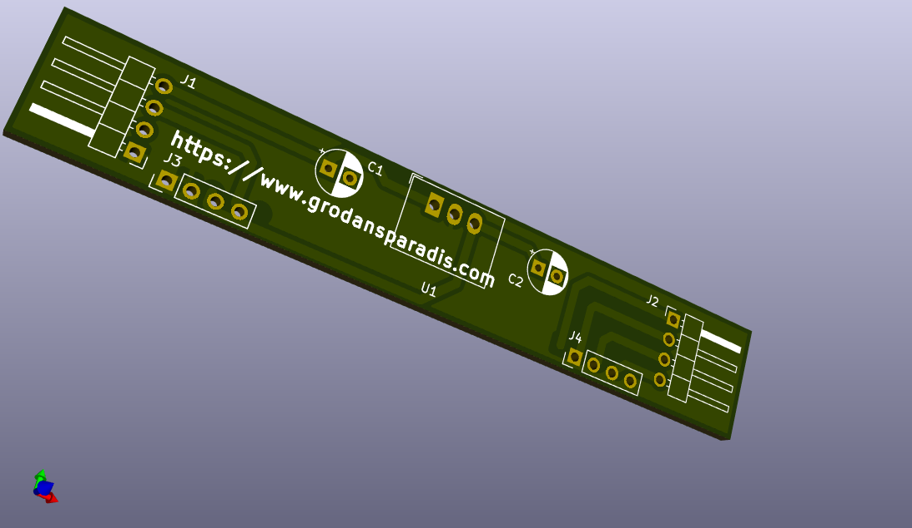
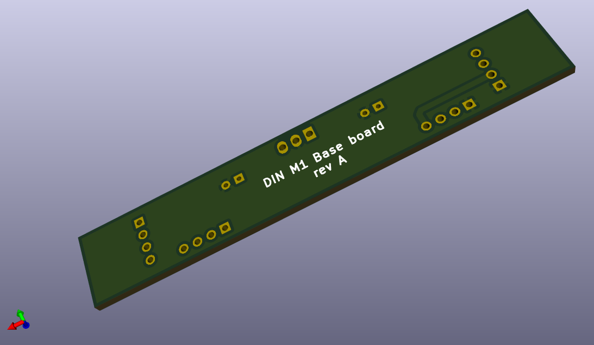

# vscp-din-m1-base-board
Base board for VSCP DIN M1 modules

**Note!** This is still a prototype.

## PCB's

 

---

Part of the [VSCP Project](https://www.vscp.org).

Copyright 2021 © Åke Hedman, (Grodans Paradis AB)[https://www.grodansparadis.com]